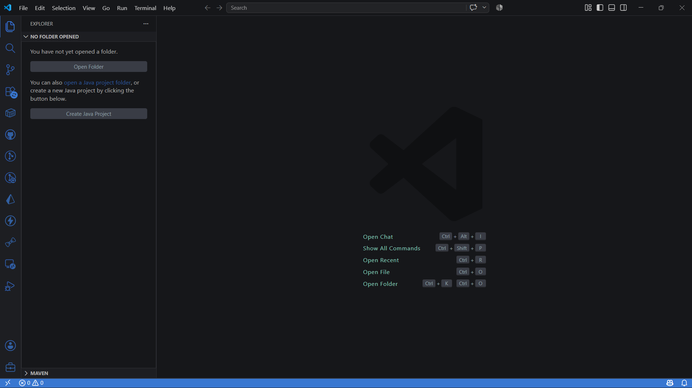
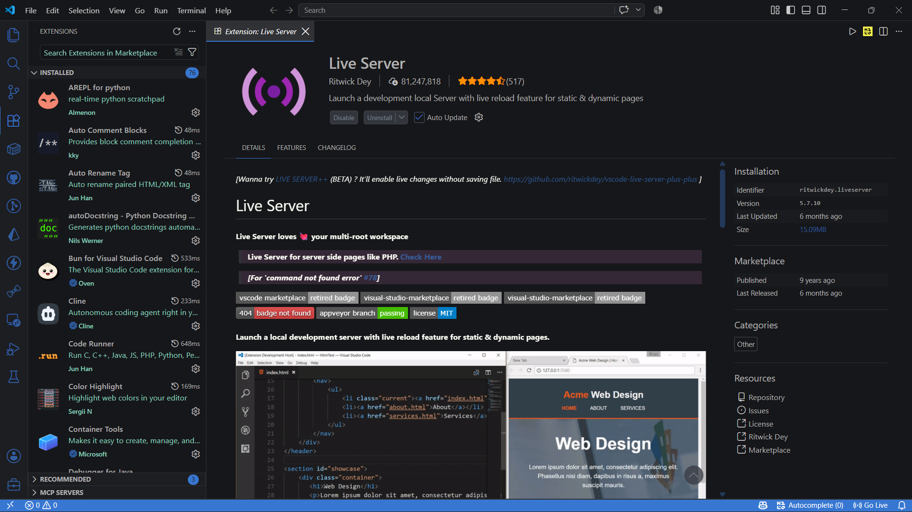
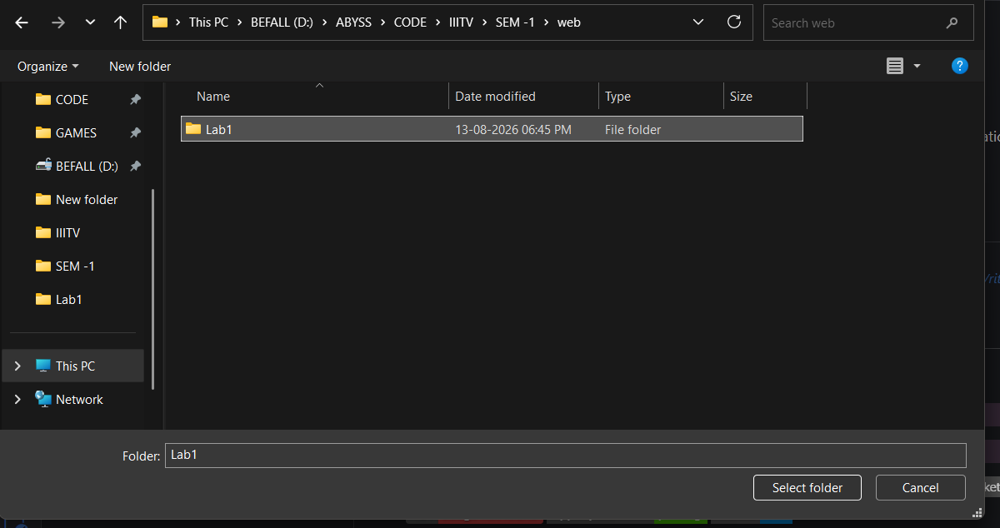
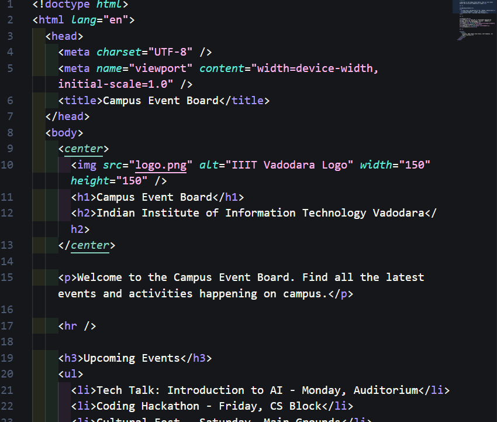
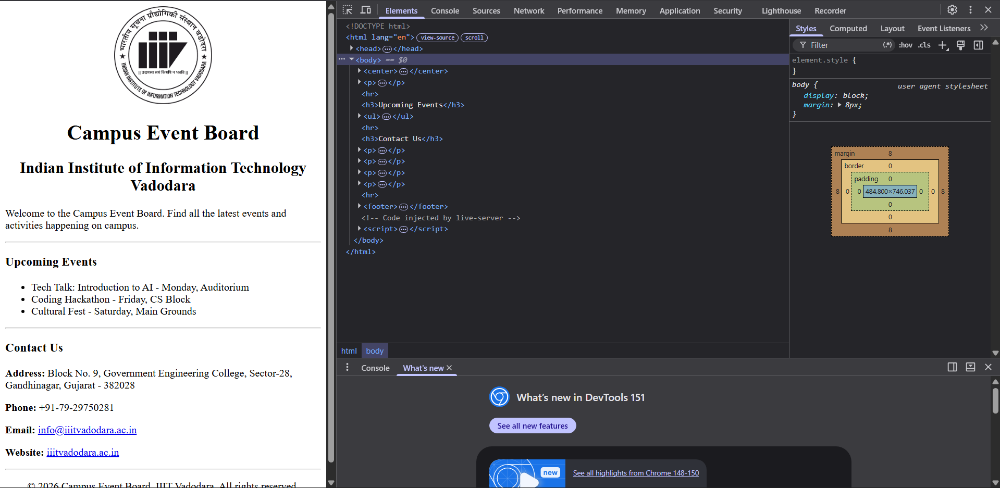

# Submission Guide - Campus Event Board (Lab 1)

This document explains the steps I followed to set up my environment and build this webpage for the Web Development Lab (Assignment 1). All the work is done in the `Lab1` folder.

---

## 1. Install VS Code

**Visual Studio Code (VS Code)** is a free, popular code editor used to write and edit HTML files.

1. Go to the official website: <https://code.visualstudio.com>
2. Click the **Download** button for your operating system (Windows, macOS, or Linux).
3. Run the downloaded installer and follow the on-screen instructions (just keep clicking **Next**).
4. Open VS Code once the installation is finished.

---

## 2. Add the Live Server extension

**Live Server** is a VS Code extension that reloads your webpage automatically every time you save your code. It runs a local server so you can see your page update instantly in the browser.

1. Open VS Code.
2. Click the **Extensions** icon in the left sidebar (looks like four small squares, or press `Ctrl + Shift + X`).
3. In the search box, type **Live Server**.
4. Find the one named **"Live Server"** by **Ritwick Dey** and click **Install**.
5. After installing, you can right-click any HTML file and select **"Open with Live Server"** to preview it.

---

## 3. Make the "Lab1" folder

This is the folder that holds all my project files.

1. In VS Code, click **File** → **Open Folder** (or `Ctrl + K`, then `Ctrl + O`).
2. Navigate to where I want the project and click **New Folder**.
3. Name the folder **Lab1** and open it.
4. Inside the folder, create a new file called **index.html** (File → New File, then type `index.html` and press Enter).

> `index.html` is the main page of the website. The browser automatically looks for a file with this name when a folder is opened.

---

## 4. How I made this page

I wrote the webpage using **HTML only** (no CSS and no JavaScript). Here is what I added, one step at a time:

1. **Document skeleton** — I started every HTML page with `<!doctype html>`, then the `<html>`, `<head>`, and `<body>` tags.
2. **Head section** — I added the `<meta>` tags and the `<title>"Campus Event Board"</title>` that shows in the browser tab.
3. **Logo** — I inserted the college logo with an `` tag and gave it a `width="150"` and `height="150"`.
4. **Headings** — I used `<h1>` for the main title ("Campus Event Board") and `<h2>` for the college name (IIIT Vadodara), and centered them with `
`.
5. **Welcome text** — I added a short welcome message in a `
` paragraph.
6. **Upcoming Events** — I listed the events using `<h3>` for the heading and an unordered list `<ul>` with `<li>` items.
7. **Contact Us** — I showed the address, phone, email, and website as `
` lines, with the labels in `<b>` (bold) and the email/website as clickable `<a>` links.
8. **Dividers** — I placed `
` lines between the sections to separate them.
9. **Footer** — I added a `<footer>` at the bottom with a copyright line using the `&copy;` symbol.
10. **Preview** — I right-clicked `index.html` and chose **"Open with Live Server"** to see the page in my browser.

---

## 5. Open "View Page Source" and see what it shows

**View Page Source** is a browser feature that displays the raw HTML code of the page.

1. Open `index.html` in a browser (for example, via Live Server).
2. Right-click anywhere on the page.
3. Select **"View Page Source"** (or press `Ctrl + U` on the keyboard).
4. A new tab opens showing the exact HTML code of the page.

**What it shows:** It displays the raw HTML source code that the browser used to render the page. In my case, this is exactly the code I wrote in `index.html` — the `<!doctype html>` declaration, the `<head>` section with the `<title>` and meta tags, and the `<body>` section containing the logo ``, the headings (`<h1>`, `<h2>`, `<h3>`), the welcome `
`, the events `<ul>` list, the Contact Us details, and the `<footer>` with the copyright symbol.

Basically, the browser reads this source code and turns it into the webpage you see on the screen.

---

*Submission for Web Development Lab (Assignment 1) - IIIT Vadodara.*